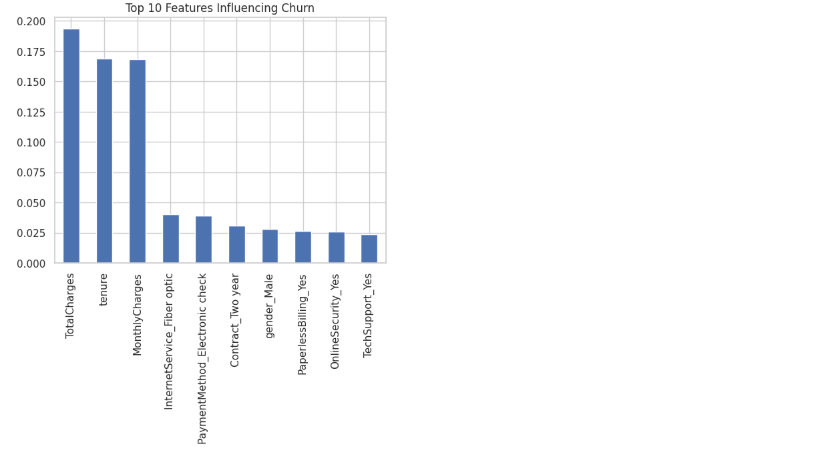

# Customer Churn Prediction System (End-to-End Machine Learning Project)

## 🧠 Business Problem
Telecom companies lose significant revenue when customers leave (churn). The goal of this project is to predict customer churn in advance so that businesses can take proactive retention actions.

---

## 🎯 Project Objective
Build a machine learning system that:
- Predicts whether a customer will churn
- Identifies high-risk customers
- Provides actionable business insights

---

## 📊 Dataset
Telco Customer Churn Dataset  
Contains customer demographics, account details, and service usage information.

---

## ⚙️ Workflow
This project follows a complete ML pipeline:

- Data Cleaning & Preprocessing
- Exploratory Data Analysis (EDA)
- Feature Engineering
- Model Building (Multiple Models)
- Model Evaluation
- Threshold Optimization
- Business Segmentation

---

## 🤖 Models Used
- Logistic Regression (Baseline)
- Decision Tree Classifier
- Random Forest Classifier (Best Model)

---

## 📈 Model Performance

 The final model was evaluated using classification metrics and business-focused evaluation.
---

## 🔑 Key Drivers of Churn

The most important features influencing customer churn:

---

## 🎯 Customer Risk Segmentation

Customers were grouped into risk categories based on churn probability:

- Low Risk
- Medium Risk
- High Risk

---

## 💡 Key Business Insights

- Month-to-month customers are most likely to churn
- Higher monthly charges increase churn probability
- Long-term contracts significantly reduce churn risk
- New customers are more vulnerable to leaving

---

## 🧠 Business Impact

This system helps businesses:
- Reduce customer churn
- Improve retention strategies
- Increase long-term revenue stability
- Target high-risk customers effectively

---

## 🛠 Tools & Technologies
- Python
- Pandas, NumPy
- Scikit-learn
- Matplotlib, Seaborn

---

## 📌 Conclusion
This project demonstrates a complete end-to-end machine learning solution that goes beyond prediction and delivers actionable business intelligence.

It is designed as a **real-world deployable churn prediction system**, not just a model.

---

## 👤 Author
Dua Zahra  
Machine Learning / Data Science Enthusiast
